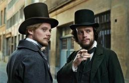

```{r setup, include=FALSE}
knitr::opts_chunk$set(echo = TRUE)
```

##  {data-background="Investigadores.jpg"}

##  {data-background="Investigadores2.jpg"}

## {data-background="gould7.jpg"}

## Hay que luchar contra el absurdo {data-background="gould7clara.jpg"}

> Stephen Jay Gould (1941 - 2002)

## el gran público {data-background=#fb4848} 

## {data-background=#ffebaa}  
1977. Ontogeny and Phylogeny. *Ontogenia y Filogenia*.
1977. Ever Since Darwin. *Desde Darwin*.
1980. The Panda's Thumb. *El pulgar del panda*.
1981. The Mismeasure of Man. *La falsa medida del hombre*.
1983. Hen's Teeth and Horse's Toes. *Dientes de gallina y dedos de caballo*.
1985. The Flamingo's Smile. *La sonrisa del flamenco*.
1987. Time's Arrow, Time's Cycle. *La flecha del tiempo*.
1987. An Urchin in the Storm: Essays about Books and Ideas.
1989. Wonderful Life. *La vida maravillosa*.

## {data-background=#ffebaa}
1991. Bully for Brontosaurus. *Brontosaurus y la nalga del ministro*.
1992. Finders, Keepers: Eight Collectors. 
1993. Eight Little Piggies. *Ocho cerditos*.
1993. The Book of Life. *El libro de la vida*.
1995. Dinosaur in a Haystack. *Un dinosaurio en un pajar*.
1996. Full House: The Spread of Excellence From Plato to Darwin. *La grandeza de la vida: la expansión de la excelencia de Platón a Darwin*.
1997. Questioning the Millennium: A Rationalist's Guide to a Precisely Arbitrary Countdown.
1998. Leonardo's Mountain of Clams and the Diet of Worms. *La montaña de almejas de Leonardo*.

## {data-background=#ffebaa}
1999. Rocks of Ages: Science and Religion in the Fullness of Life. *Ciencia versus religión, un falso conflicto*.
2000. The Lying Stones of Marrakech. *Las piedras falaces de Marrakech*.
2000. Crossing Over: Where Art and Science Meet. 
2002. The Structure of Evolutionary Theory. *La estructura de la teoría de la evolución*.
2002. I Have Landed: The End of a Beginning in Natural History. *Acabo de llegar: el final de un principio en historia natural*.
2003. Triumph and Tragedy in Mudville: A Lifelong Passion for Baseball.
2003. The Hedgehog, the Fox, and the Magister's Pox. *Érase una vez el zorro y el erizo*.

## la teoría {data-background=#fb4848} 

## {data-background=#ffebaa}
### Equilibrios Puntuados
 


## {data-background=#ffebaa}

   
Aún los mayores logros científicos están enraizados en su contexto cultural. El gradualismo es parte del contexto cultural, no de naturaleza. (...) Otras concepciones del cambio tienen respetables antecedentes. Una ley, enfatizada por Engels, sostiene que el cambio cualitativo emerge de repente, cuando la lenta acumulación de cambios cuantitativos, (...) finalmente lo fuerza a cambiar de un estado a otro. GOULD y ELDREDGE 1977.

## {data-background=#ffebaa}
Exponer las condiciones sociales detrás del origen de las ideas no dicen nada sobre su validez. Ésta debe establecerse por los procedimientos científicos habituales de observación, experimentación y prueba.   
La mejor forma de objetividad consiste en identificar explícitamente las preferencias, de modo que su influencia pueda ser reconocida.

## la calle {data-background=#fb4848} 

## {data-background="vietnam.png"}

## {data-background="vietnamclara.png"}
> En 1969, siendo profesor asistente en Harvard, se sumó a las protestas de los estudiantes que habían tomado el campus en oposición a la participación de la universidad en la guerra de Vietnam. Lo hizo sin tener: "cargo fijo o reputación, mientras los demás profesores miraban para otro lado" según señala el escritor Michael Ryan. Hacia 1971 se unió a los Estudiantes por una Sociedad Democrática y participó en protestas contra la segregación racial. Por la misma fecha se unió a Science for the People.

## {data-background=#fb4848} 
### ¿Qué fue Science for the People? 
 

## {data-background="industria.png"}

## {data-background="industriaclara.png"}

**La ciencia no es neutral.** Aunque una investigación se lleve a cabo de acuerdo a determinados criterios científicos, el contexto donde ésta investigación se realiza es cualquier cosa excepto neutral. No sólo el tipo de ciencia que se hace, sino también el uso que se le da, es dependiente de las necesidades tecnológicas de aquellos que sostienen la ciencia. 

## {data-background="workers.png"}

## {data-background="workersclara.png"}
**Unirse a otros trabajadores para hacer que la ciencia sirva al pueblo.**  Entonces, ¿cuál es la solución? Debemos cambiar fundamentalmente el presente sistema económico y social -un sistema no democrático que deja insatisfechas las necesidades de vivienda, educacionales, médicas y nutricionales de una gran parte de su población, mientras el hombre pasea por la luna. (...) *Nosotros los científicos somos trabajadores.* Nuestra única esperanza (...) es unirnos con todos los otros trabajadores para lograr un cambio radical en el pensamiento, objetivos y estructura económica de este país.

## {data-background="biotecno.png"}

## {data-background="biotecnoclara.png"}
**Ciencia para el Pueblo.** En una escala aún más amplia los científicos pueden ayudar a desmitificar la ciencia para el público. Nosotros podemos destruir el mito del experto científico que todo lo sabe o de tecnócrata infalible (...) Podemos hacer notar el contenido político de las decisiones que son justificadas por el gobierno o la industria en un sustento tecnológico. 

## {data-background=#fb4848} 
### ¿Qué puede hacer un biólogo evolutivo para luchar contra el absurdo? 

 

## {data-background=#ffebaa}
> **determinismo biológico** Consiste en afirmar que tanto las normas de conducta compartidas como las diferencias sociales y económicas que existen entre los grupos — básicamente, diferencias de raza, de clase y de sexo — derivan de ciertas distinciones heredadas, innatas, y que, (...) la sociedad constituye un reflejo fiel de la biología.

## {data-background="lanacion.png"}

## {data-background="lanacionclara.png"}
### La Nación 29 de junio de 2017:
> Dubcovsky agregó: "Según estudios de neurociencia las mujeres tendrían más facilidad para identificar las emociones y pensamientos de las otras personas y responder a ellos con una emoción adecuada. Estarían predispuestas a entender mejor a las otras personas, predecir su comportamiento y conectarse emocionalmente con ellas. Esta capacidad de «empatía» podría explicar que las mujeres elijan mayoritariamente carreras humanísticas".   

## {data-background=#ffebaa}
### Eudeba, 2016.
> Esos hombres que no celan, que no controlan, no están alertas, no ponen límites y toleran la infidelidad, tendrán altas probabilidades de gastar energía en criar los genes de otros (que sí llevan la información para ser celosos) (…) Por lógica pura: la conducta celosa debe ser constitutiva de la naturaleza humana.

## {data-background=#fb4848} 
> Grande es la fuerza de la tergiversación continua. DARWIN, 1872.

## {data-background=#ffebaa}
A 15 años de la muerte de Stephen Jay Gould destacamos su labor por disminuir la distancia entre el conocimiento que generamos como científicos y la sociedad, por discutir las implicaciones sociales que conlleva la producción de conocimiento, alertarnos acerca de que el conocimiento puede ser utilizado para justificar relaciones de poder y por destacar la no neutralidad de la ciencia.

## {data-background=#ffebaa}
   
 